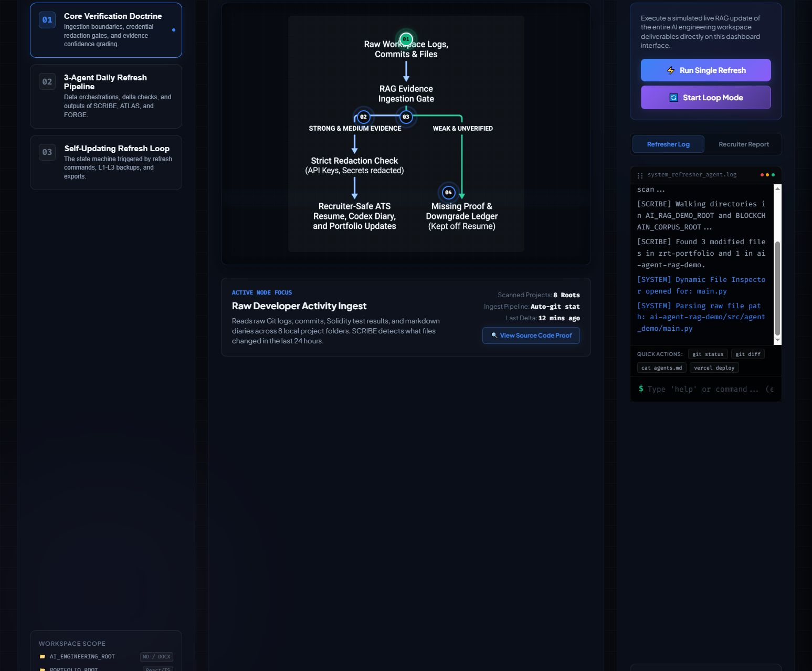
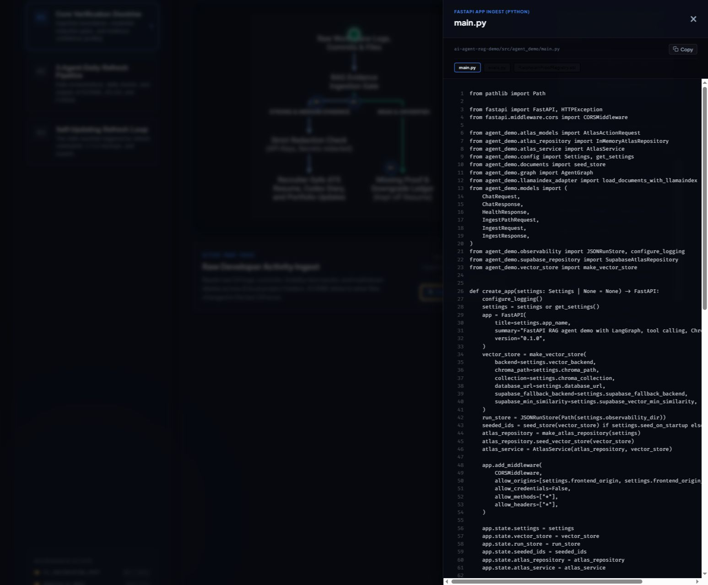
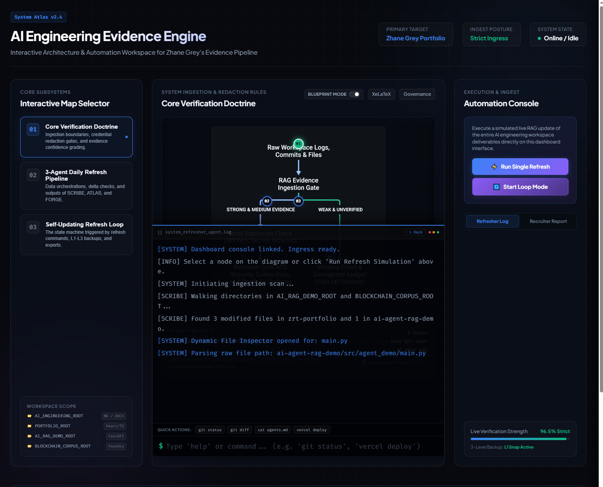

# AI Engineering Evidence Engine

Live demo: https://zhane-grey-evidence-dashboard.vercel.app/

This repository is the public landing page for the **AI Engineering Evidence Engine Dashboard**. It is built to help an employer understand one thing quickly: the system turns local engineering proof into a reviewable dashboard, instead of relying on vague portfolio claims.

## Visual Tour

The dashboard is easier to understand in three states:

| Dashboard overview | Proof drawer | Docked console |
|---|---|---|
|  |  |  |

The console log is intentionally draggable. When it is docked into the hero area, the live log stream sits beside the doctrine map so reviewers can see telemetry and proof in the same visual frame.

## What This Demonstrates

- Interactive evidence surfacing for recruiter review
- Proof-oriented UI patterns instead of narrative-only claims
- Secret-redaction and evidence-boundary controls
- Source-code inspection from inside the dashboard
- Clear state handling for verification, ingestion, and reporting
- A draggable terminal mode that lets the log stream join the main evidence map

## Verified Implementation Signals

The dashboard is backed by local files in the `systems-dashboard/` workspace, including:

- `index.html` for the dashboard shell and proof drawer
- `styles.css` for the glassmorphic presentation layer
- `app.js` for hotspot behavior, redaction flows, proof drawer logic, and evidence state handling
- `vercel.json` for deployment routing

The codebase includes explicit proof-oriented UI patterns such as:

- Interactive hotspots tied to dashboard sections
- A source-code drawer for local proof inspection
- Secret-redaction review flows
- State handling around proof selection and UI synchronization
- A dockable terminal that can be dragged into the hero zone for live log context

## Why an Employer Should Care

This project shows how I build under review conditions:

- I make claims traceable to local code and artifacts.
- I separate verified behavior from simulation.
- I structure dashboards so proof is easy to inspect quickly.
- I treat accessibility, reviewability, and evidence boundaries as first-class requirements.

## Fast Path For Reviewers

If you only look at three things, look at these:

1. The dashboard overview screenshot.
2. The docked console screenshot.
3. The `app.js` and `index.html` implementation that drives the proof flow.

## Related Proof

- Resume: `Zhane_Grey_AI_Engineer_ATS_Resume.md`
- Systems dashboard workspace: `systems-dashboard/`
- Live portfolio evidence files: root AI Engineer documents and daily evidence reports

## Notes

- This README is employer-facing and intentionally concise.
- It describes verified local work, not production status.
- Any simulated or demo-only behavior should remain labeled clearly in the UI and supporting docs.

## On-Chain Systems Portfolio

Core XRPL EVM systems plus related public product and AI repositories from the same portfolio.

<table>
  <thead>
    <tr>
      <th>Project</th>
      <th>Description</th>
      <th>Status</th>
    </tr>
  </thead>
  <tbody>
    <tr>
      <td><a href="https://github.com/zrt219/Zuc-Mine-Command-Center">ZUC Mine Command Center</a></td>
      <td>On-chain uranium mining operations dashboard with real-time reserve tracking, miner registry, and direct contract interaction through a frontend-only control surface.</td>
      <td><a href="https://zuc-mine-command-center.vercel.app/">Live</a></td>
    </tr>
    <tr>
      <td><a href="https://github.com/zrt219/-U235-Fuel-Cycle-">U235 Fuel Cycle</a></td>
      <td>Deterministic XRPL EVM fuel-cycle pipeline that tracks uranium batches from ore to enriched fuel rod with full on-chain traceability.</td>
      <td><a href="https://u235-fuel-cycle.vercel.app/">Live</a></td>
    </tr>
    <tr>
      <td><a href="https://github.com/zrt219/ISR-Network">ISR Network</a></td>
      <td>In-situ recovery control system with on-chain asset tracking, lifecycle state transitions, and operator-facing industrial simulation.</td>
      <td><a href="https://isr-network.vercel.app/">Live</a></td>
    </tr>
    <tr>
      <td><a href="https://github.com/zrt219/Dark-Matter-Farm">Dark Matter Farm</a></td>
      <td>XRPL EVM staking protocol with three orbit tiers, lock-period yield mechanics, and event-driven reward emissions.</td>
      <td><a href="https://dark-matter-farm.vercel.app/">Live</a></td>
    </tr>
    <tr>
      <td><a href="https://github.com/zrt219/Cohr-Lab">Cohr Lab</a></td>
      <td>Semiconductor laser fabrication lifecycle modeled as an immutable on-chain state machine from crystal growth to final pigtail.</td>
      <td><a href="https://cohr-lab.vercel.app">Live</a></td>
    </tr>
    <tr>
      <td><a href="https://github.com/zrt219/ForgeX">ForgeX</a></td>
      <td>Foundry-powered XRPL EVM deployment console that combines a natural-language UI, Node CLI orchestration, and realtime shader-based visuals.</td>
      <td><a href="https://forgex-theta.vercel.app">Live</a></td>
    </tr>
    <tr>
      <td><a href="https://github.com/zrt219/DatumX">DatumX</a></td>
      <td>Verification protocol for AI-transformed industrial data with deterministic lineage, validator review, and XRPL EVM finalization.</td>
      <td><a href="https://datumx.vercel.app">Live</a></td>
    </tr>
    <tr>
      <td><a href="https://github.com/zrt219/Ethex-Lottery-Game">Ethex Lottery Game</a></td>
      <td>Foundry plus Next.js betting workflow that modernizes the EthexLoto lifecycle for XRPL EVM reviewer-facing execution.</td>
      <td>Public Repo</td>
    </tr>
    <tr>
      <td><a href="https://github.com/zrt219/3DMoonX">3DMoonX</a></td>
      <td>Cinematic lunar industrial-base experience that combines Blender source assets with a React Three Fiber web runtime.</td>
      <td><a href="https://3dmoonx.vercel.app">Live</a></td>
    </tr>
    <tr>
      <td><a href="https://github.com/zrt219/Unknown002">Unknown002</a></td>
      <td>Browser-based 3D engineering viewer for a nuclear-electric propulsion spacecraft concept with staged prompt-pack support.</td>
      <td>Public Repo</td>
    </tr>
    <tr>
      <td><a href="https://github.com/zrt219/AI-Engineering-Evidence-Engine">AI Engineering Evidence Engine</a></td>
      <td>Interactive evidence dashboard that turns local engineering proof into a reviewer-facing systems narrative.</td>
      <td><a href="https://zhane-grey-evidence-dashboard.vercel.app/">Live</a></td>
    </tr>
    <tr>
      <td><a href="https://github.com/zrt219/Build-Doctor">Build Doctor</a></td>
      <td>Codex-style build diagnosis harness for failed Next.js and Vercel builds with deterministic failure analysis.</td>
      <td><a href="https://vercel-build-doctor-agent.vercel.app">Live</a></td>
    </tr>
    <tr>
      <td><a href="https://github.com/zrt219/ai-gateway-failover-playground">AI Gateway Failover Playground</a></td>
      <td>Public-facing sandbox for request routing, provider fallback, and resilient AI gateway behavior.</td>
      <td><a href="https://ai-gateway-failover-playground.vercel.app">Live</a></td>
    </tr>
    <tr>
      <td><a href="https://github.com/zrt219/enterprise-agent-workflow-studio">Enterprise Agent Workflow Studio</a></td>
      <td>Public-facing studio for approval-gated enterprise agent workflows, risk scoring, and audit-oriented design.</td>
      <td><a href="https://enterprise-agent-workflow-studio.vercel.app">Live</a></td>
    </tr>
    <tr>
      <td><a href="https://github.com/zrt219/resume-evidence-rag-auditor">Resume Evidence RAG Auditor</a></td>
      <td>Public-facing proof surface for claim verification, evidence retrieval, and grounded resume bullet generation.</td>
      <td><a href="https://resume-evidence-rag-auditor.vercel.app">Live</a></td>
    </tr>
    <tr>
      <td><a href="https://github.com/zrt219/AI-resume-tailor-service-">AI Resume Tailor Service</a></td>
      <td>Static Vercel-ready application for evidence-backed resume, cover-letter, and job-packet tailoring.</td>
      <td><a href="https://ai-resume-tailor-service.vercel.app">Live</a></td>
    </tr>
    <tr>
      <td><a href="https://github.com/zrt219/Fuji">Fuji</a></td>
      <td>Cinematic Next.js Fuji gallery atlas for portfolio storytelling and visual system design.</td>
      <td><a href="https://fuji-byzrt.vercel.app">Live</a></td>
    </tr>
    <tr>
      <td><a href="https://github.com/zrt219/ai-agents-for-beginners">AI Agents for Beginners</a></td>
      <td>Lesson repository for getting started building AI agents.</td>
      <td>Public Repo</td>
    </tr>
    <tr>
      <td><a href="https://github.com/zrt219/agentic-rag-memory-digital-twin-edge-system">Agentic RAG Memory Digital Twin Edge System</a></td>
      <td>Public-facing landing page for an agentic RAG, memory, and digital-twin edge-system portfolio project.</td>
      <td><a href="https://agentic-rag-memory-digital-twin-edg.vercel.app">Live</a></td>
    </tr>
  </tbody>
</table>

