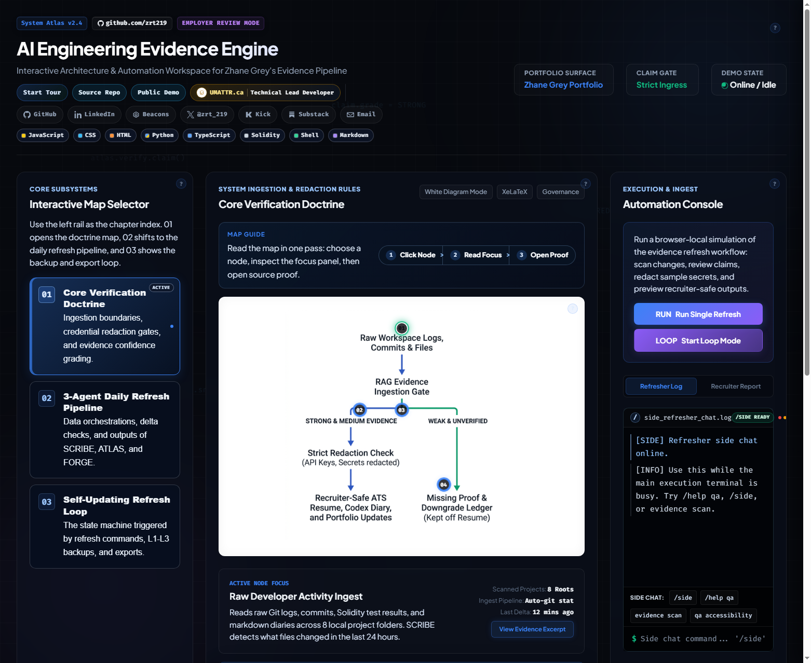
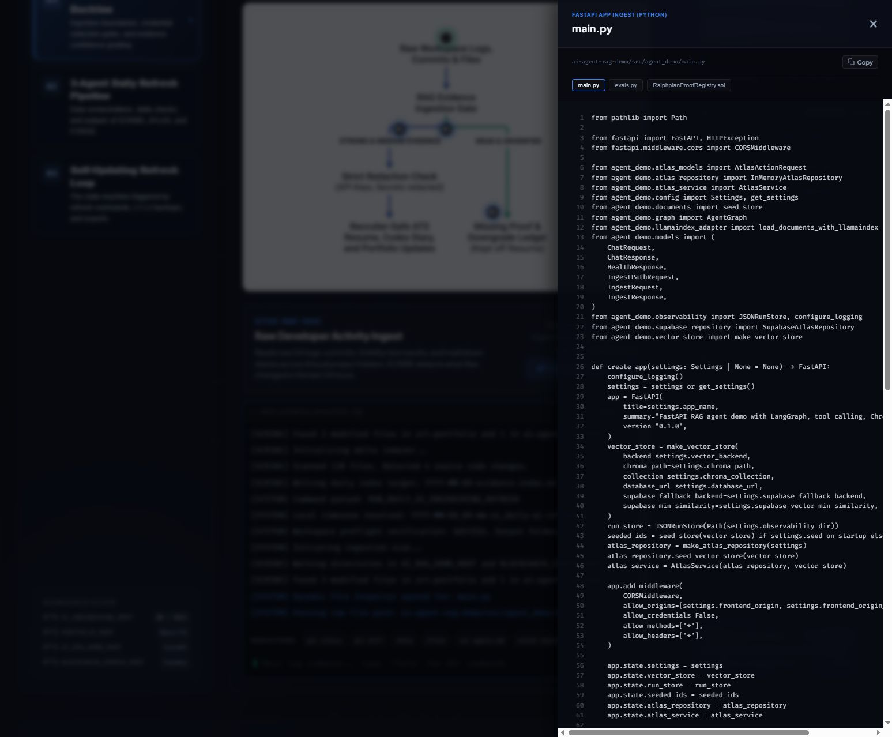
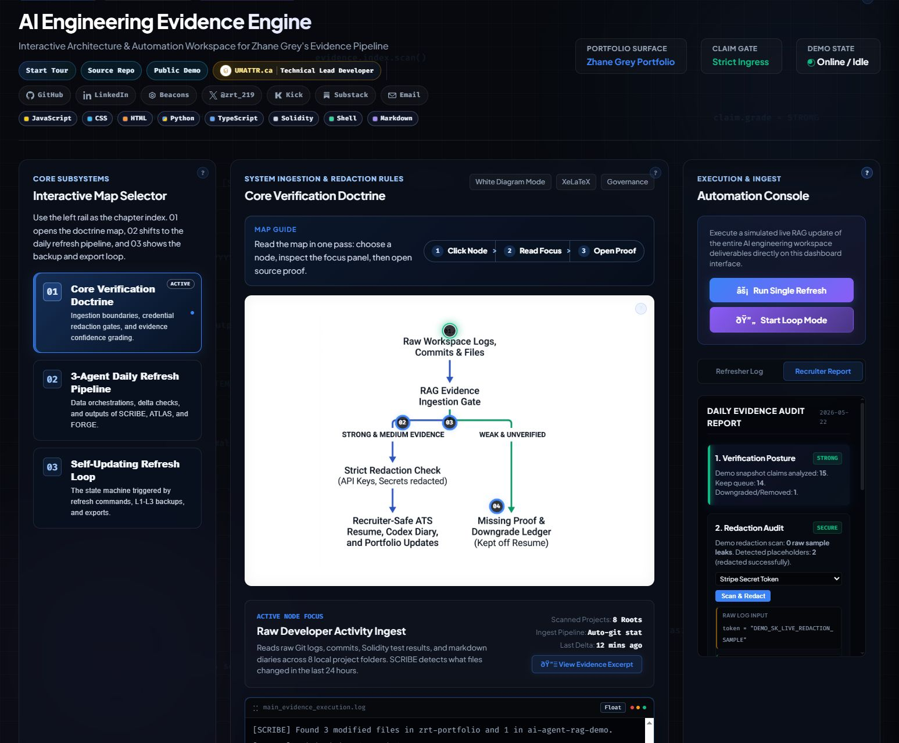
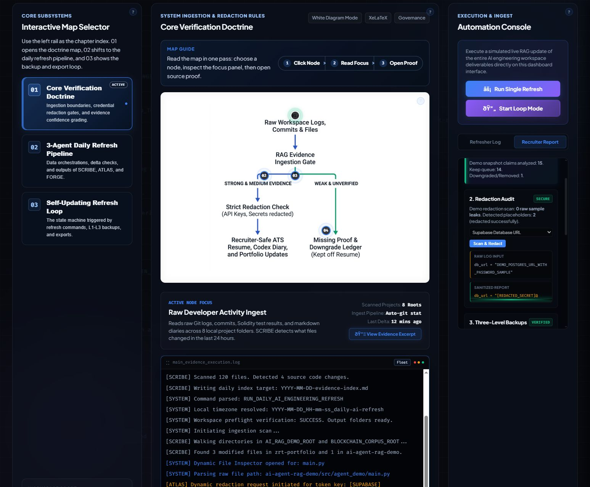
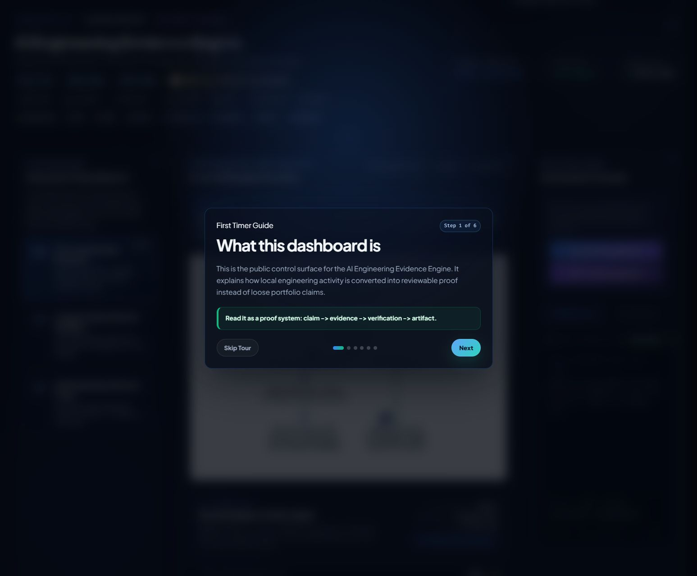
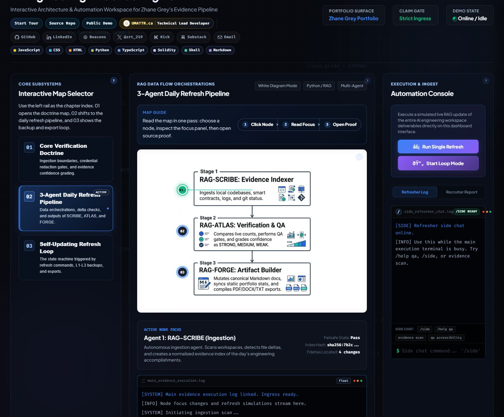
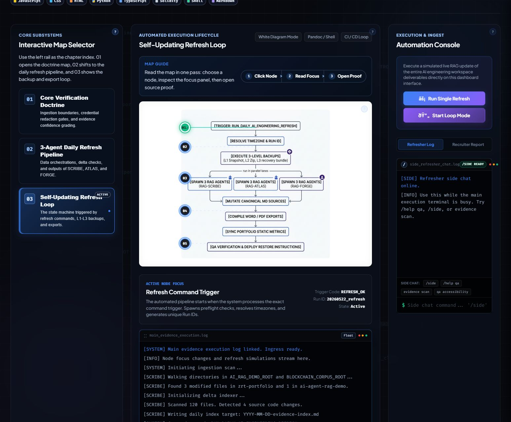
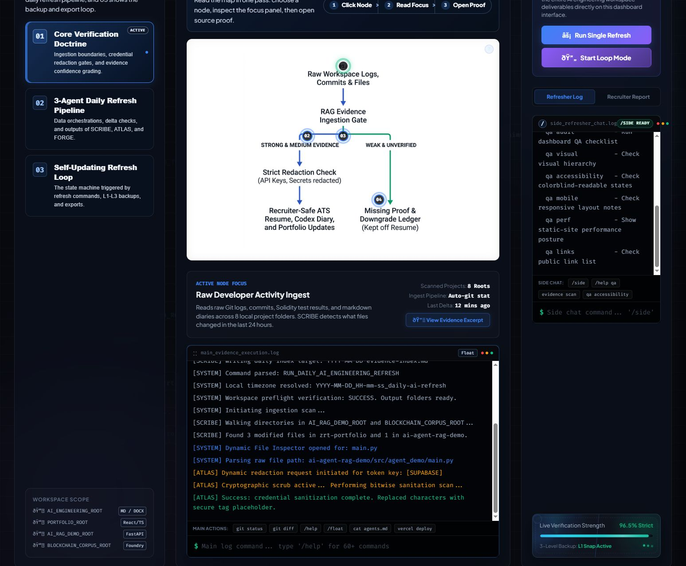
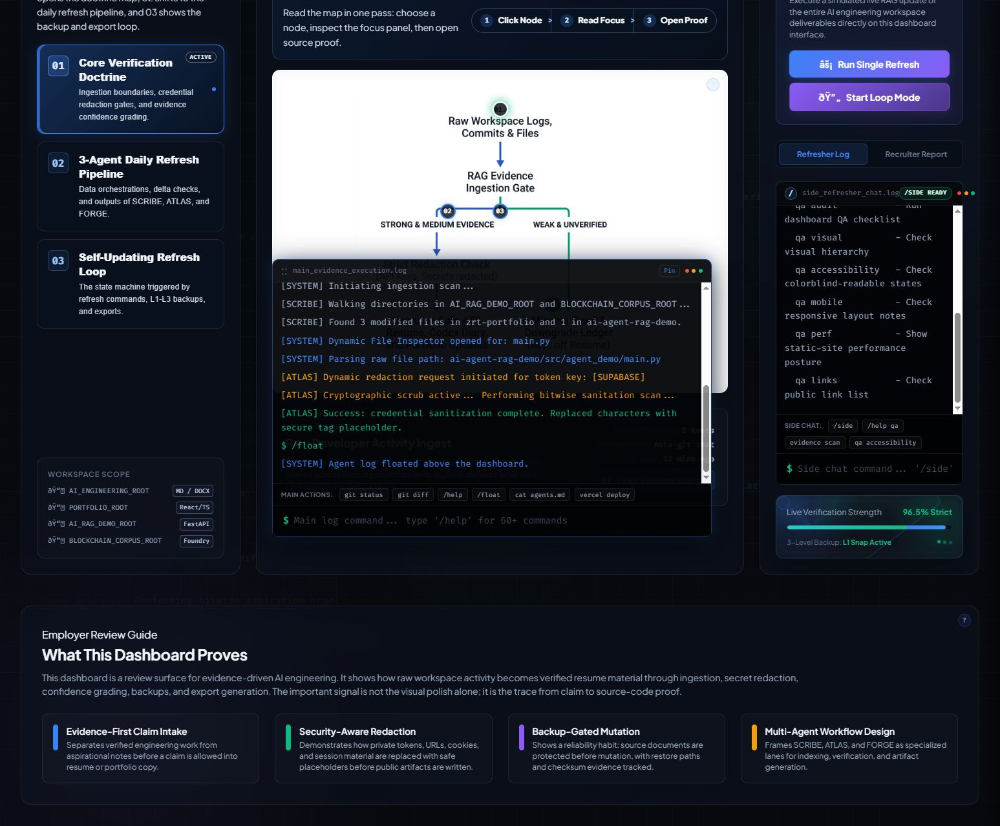
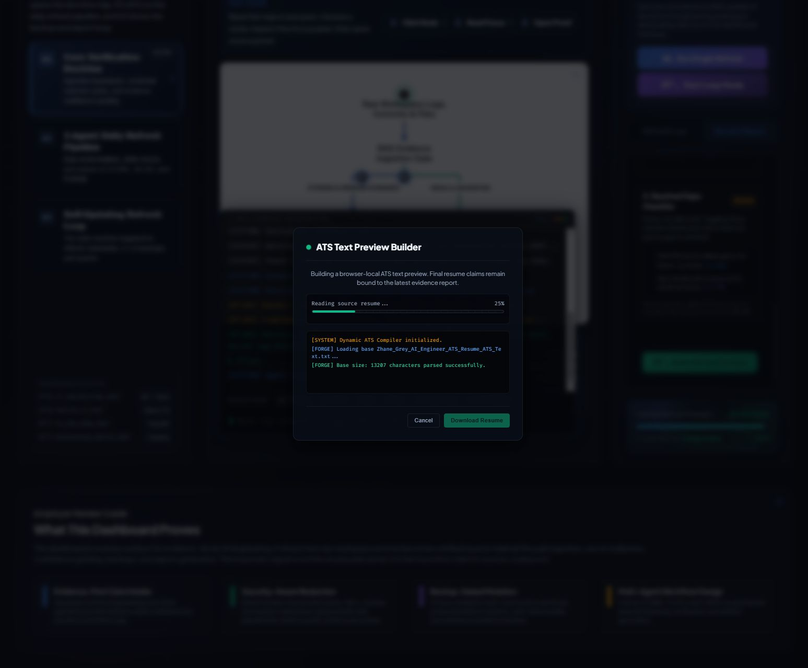

# AI Engineering Evidence Engine

Public demo URL: https://zhane-grey-evidence-dashboard.vercel.app/

This repository is the public review surface for the **AI Engineering Evidence Engine Dashboard**. It helps an employer understand how local engineering evidence can be organized into a traceable dashboard instead of relying on vague portfolio claims.

## Employer Review Summary

The dashboard demonstrates an evidence-first AI engineering workflow:

- Map raw developer activity into reviewable system nodes.
- Keep unsupported claims out of resume-facing material.
- Show source-code proof excerpts inside the UI.
- Simulate evidence refresh, redaction, report, and export workflows.
- Separate browser-local demo behavior from verified evidence claims.

## Screenshot Tour

The overview screenshot shows the employer review path: subsystem rail, white diagram mode, active focus panel, dual terminal surfaces, and evidence-bound status cards.



The detail screenshots below are organized by review signal so employers can inspect the behavior without hunting through the whole page.

| Source proof drawer | Recruiter report | Redaction demo |
|---|---|---|
|  |  |  |
| Ties a visual claim back to source excerpts. | Shows evidence-bound review posture and gap handling. | Demonstrates demo-secret sanitization before public display. |

| Guided tour | Pipeline map | Workflow map |
|---|---|---|
|  |  |  |
| Explains first-time reviewer context. | Shows SCRIBE, ATLAS, and FORGE lane separation. | Shows backup-gated refresh lifecycle. |

| Side chat | Console help | ATS preview |
|---|---|---|
|  |  |  |
| Keeps the side rail usable while main execution runs. | Documents command discovery in the terminal UI. | Builds a browser-local text preview, not a verified final resume. |

## 360 Button Audit

The latest audit used six lanes: controls/events, terminal stress, modals/tour, security/claim boundaries, README/screenshots, and deployment readiness.

| Area | Controls Tested | Expected Behavior | Current Status |
|---|---|---|---|
| Header | Start Tour, proof links, social links | Opens guide or external profile/demo/repo links | Passed source and browser checks |
| Map selector | Doctrine, Pipeline, Workflow cards | Switches image, title, metrics, and hotspot set | Passed browser checks |
| Hotspots | Diagram nodes and focus panel | Updates focus copy, metrics, and proof CTA | Passed browser checks |
| Main terminal | Suggestions, `/help`, `/float`, `/dock`, `/tray` | Runs browser-local command surface and layout modes | Passed via suggestion-chip checks |
| Side terminal | `/side`, `/help qa`, evidence, QA commands | Stays independent from main execution stream | Passed browser checks |
| Refresh controls | Run Single Refresh, Start Loop Mode | Simulates refresh stream; loop guard blocks overlap | Guard fixed and verified |
| Recruiter report | Report cards, redaction selector, scan button | Shows report UI and sanitized demo samples | Demo-secret wording fixed |
| Gap checklist | Two proof-gap checkboxes | Previews review posture only, no claim upgrade | Claim-boundary wording fixed |
| Proof drawer | Open, close, tabs, copy | Shows evidence excerpts and tab state | ARIA tab state added |
| ATS preview | Open, cancel, completion state | Builds browser-local ATS text preview | Copy/title overclaim fixed |
| Background | Ambient command stream | Subtle pointer-reactive evidence atmosphere | Passed browser smoke |

## Tutorial Slides

These screenshots mirror the first-time reviewer flow:

1. 
2. 
3. 
4. 
5. 
6. 

## Interaction Map

- `index.html` defines the dashboard shell, tour, map panels, terminals, report tab, proof drawer, and ATS preview modal.
- `styles.css` defines the glassmorphic visual system, white diagram mode, colorblind-readable states, ambient evidence stream, and responsive behavior.
- `app.js` drives diagram switching, hotspot focus, dual terminals, command catalog, simulated refresh, redaction demo, proof drawer, and modal lifecycle.
- `vercel.json` configures the static Vercel deployment.

## Evidence Boundaries

This is a static browser dashboard. The refresh stream, terminal commands, redaction scan, deploy command, and ATS preview are intentionally browser-local simulations unless a separate daily evidence report or source file proves the underlying action.

Security boundary choices:

- Demo secrets are labeled as demo samples and redacted before display.
- No private keys, service-role tokens, raw session logs, or live credentials are required by the public app.
- Checklist toggles do not upgrade resume claims; they only preview review posture.
- Embedded proof excerpts are static review snippets, not live filesystem reads.

## Reviewer Fast Path

1. Open the public demo.
2. Click `Start Tour`.
3. Switch all three subsystem cards.
4. Click `View Evidence Excerpt`.
5. Use the side Refresher Log for `/help qa`.
6. Open `Recruiter Report` and run the redaction demo.
7. Review `app.js`, `index.html`, and `styles.css` for implementation proof.

## Local Development

- This README is employer-facing and intentionally concise.
- It describes verified local work, not production status.
- Any simulated or demo-only behavior should remain labeled clearly in the UI and supporting docs.

## On-Chain Systems Portfolio

Core XRPL EVM systems plus related public product and AI repositories from the same portfolio.

<table>
  <thead>
    <tr>
      <th>Project</th>
      <th>Description</th>
      <th>Status</th>
    </tr>
  </thead>
  <tbody>
    <tr>
      <td><a href="https://github.com/zrt219/Zuc-Mine-Command-Center">ZUC Mine Command Center</a></td>
      <td>On-chain uranium mining operations dashboard with real-time reserve tracking, miner registry, and direct contract interaction through a frontend-only control surface.</td>
      <td><a href="https://zuc-mine-command-center.vercel.app/">Live</a></td>
    </tr>
    <tr>
      <td><a href="https://github.com/zrt219/-U235-Fuel-Cycle-">U235 Fuel Cycle</a></td>
      <td>Deterministic XRPL EVM fuel-cycle pipeline that tracks uranium batches from ore to enriched fuel rod with full on-chain traceability.</td>
      <td><a href="https://u235-fuel-cycle.vercel.app/">Live</a></td>
    </tr>
    <tr>
      <td><a href="https://github.com/zrt219/ISR-Network">ISR Network</a></td>
      <td>In-situ recovery control system with on-chain asset tracking, lifecycle state transitions, and operator-facing industrial simulation.</td>
      <td><a href="https://isr-network.vercel.app/">Live</a></td>
    </tr>
    <tr>
      <td><a href="https://github.com/zrt219/Dark-Matter-Farm">Dark Matter Farm</a></td>
      <td>XRPL EVM staking protocol with three orbit tiers, lock-period yield mechanics, and event-driven reward emissions.</td>
      <td><a href="https://dark-matter-farm.vercel.app/">Live</a></td>
    </tr>
    <tr>
      <td><a href="https://github.com/zrt219/Cohr-Lab">Cohr Lab</a></td>
      <td>Semiconductor laser fabrication lifecycle modeled as an immutable on-chain state machine from crystal growth to final pigtail.</td>
      <td><a href="https://cohr-lab.vercel.app">Live</a></td>
    </tr>
    <tr>
      <td><a href="https://github.com/zrt219/ForgeX">ForgeX</a></td>
      <td>Foundry-powered XRPL EVM deployment console that combines a natural-language UI, Node CLI orchestration, and realtime shader-based visuals.</td>
      <td><a href="https://forgex-theta.vercel.app">Live</a></td>
    </tr>
    <tr>
      <td><a href="https://github.com/zrt219/DatumX">DatumX</a></td>
      <td>Verification protocol for AI-transformed industrial data with deterministic lineage, validator review, and XRPL EVM finalization.</td>
      <td><a href="https://datumx.vercel.app">Live</a></td>
    </tr>
    <tr>
      <td><a href="https://github.com/zrt219/Ethex-Lottery-Game">Ethex Lottery Game</a></td>
      <td>Foundry plus Next.js betting workflow that modernizes the EthexLoto lifecycle for XRPL EVM reviewer-facing execution.</td>
      <td>Public Repo</td>
    </tr>
    <tr>
      <td><a href="https://github.com/zrt219/3DMoonX">3DMoonX</a></td>
      <td>Cinematic lunar industrial-base experience that combines Blender source assets with a React Three Fiber web runtime.</td>
      <td><a href="https://3dmoonx.vercel.app">Live</a></td>
    </tr>
    <tr>
      <td><a href="https://github.com/zrt219/Unknown002">Unknown002</a></td>
      <td>Browser-based 3D engineering viewer for a nuclear-electric propulsion spacecraft concept with staged prompt-pack support.</td>
      <td>Public Repo</td>
    </tr>
    <tr>
      <td><a href="https://github.com/zrt219/AI-Engineering-Evidence-Engine">AI Engineering Evidence Engine</a></td>
      <td>Interactive evidence dashboard that turns local engineering proof into a reviewer-facing systems narrative.</td>
      <td><a href="https://zhane-grey-evidence-dashboard.vercel.app/">Live</a></td>
    </tr>
    <tr>
      <td><a href="https://github.com/zrt219/Build-Doctor">Build Doctor</a></td>
      <td>Codex-style build diagnosis harness for failed Next.js and Vercel builds with deterministic failure analysis.</td>
      <td><a href="https://vercel-build-doctor-agent.vercel.app">Live</a></td>
    </tr>
    <tr>
      <td><a href="https://github.com/zrt219/ai-gateway-failover-playground">AI Gateway Failover Playground</a></td>
      <td>Public-facing sandbox for request routing, provider fallback, and resilient AI gateway behavior.</td>
      <td><a href="https://ai-gateway-failover-playground.vercel.app">Live</a></td>
    </tr>
    <tr>
      <td><a href="https://github.com/zrt219/enterprise-agent-workflow-studio">Enterprise Agent Workflow Studio</a></td>
      <td>Public-facing studio for approval-gated enterprise agent workflows, risk scoring, and audit-oriented design.</td>
      <td><a href="https://enterprise-agent-workflow-studio.vercel.app">Live</a></td>
    </tr>
    <tr>
      <td><a href="https://github.com/zrt219/resume-evidence-rag-auditor">Resume Evidence RAG Auditor</a></td>
      <td>Public-facing proof surface for claim verification, evidence retrieval, and grounded resume bullet generation.</td>
      <td><a href="https://resume-evidence-rag-auditor.vercel.app">Live</a></td>
    </tr>
    <tr>
      <td><a href="https://github.com/zrt219/AI-resume-tailor-service-">AI Resume Tailor Service</a></td>
      <td>Static Vercel-ready application for evidence-backed resume, cover-letter, and job-packet tailoring.</td>
      <td><a href="https://ai-resume-tailor-service.vercel.app">Live</a></td>
    </tr>
    <tr>
      <td><a href="https://github.com/zrt219/Fuji">Fuji</a></td>
      <td>Cinematic Next.js Fuji gallery atlas for portfolio storytelling and visual system design.</td>
      <td><a href="https://fuji-byzrt.vercel.app">Live</a></td>
    </tr>
    <tr>
      <td><a href="https://github.com/zrt219/ai-agents-for-beginners">AI Agents for Beginners</a></td>
      <td>Lesson repository for getting started building AI agents.</td>
      <td>Public Repo</td>
    </tr>
    <tr>
      <td><a href="https://github.com/zrt219/agentic-rag-memory-digital-twin-edge-system">Agentic RAG Memory Digital Twin Edge System</a></td>
      <td>Public-facing landing page for an agentic RAG, memory, and digital-twin edge-system portfolio project.</td>
      <td><a href="https://agentic-rag-memory-digital-twin-edg.vercel.app">Live</a></td>
    </tr>
  </tbody>
</table>

This is a static site. A local smoke server is enough:

```powershell
python -m http.server 4183 --bind 127.0.0.1
```

Then open:

```text
http://127.0.0.1:4183/index.html
```

Basic verification:

```powershell
node --check app.js
git diff --check
```

## Known Demo Limits

- No backend API is required for the public dashboard.
- No real Vercel deploy runs from the browser terminal.
- The ATS preview downloads text, not a generated PDF.
- Public screenshots are review aids, not proof of private production usage.
